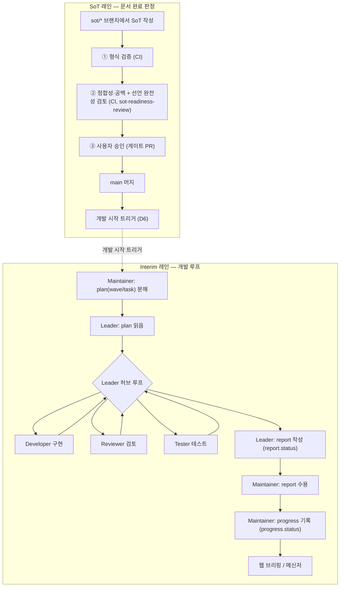

# AXDT 워크플로 개관

> **비권위(non-SoT) 문서.** 이 문서는 SoT·interim 문서의 생애와 실제 작업 흐름을 사람이 한눈에 보기 위한 참고 자료이며, 그 자체로는 권위본이 아니다. 아래 정의가 `docs/sot/rule/`·`WIP/adr/`의 내용과 어긋나면 **SoT가 이긴다**. 각 항목은 권위 출처를 링크한다.

## 1. 개요

이 문서의 목적은 두 가지다.

1. **SoT 문서 생애**(작성 → 검토 → 사용자 승인 → 개발 트리거)와 **interim 개발 루프**(plan → report → progress)의 관계를 한 장의 그림으로 정리한다.
2. 지금까지 `WIP/TODO.md`·`docs/sot/rule/*`·`WIP/adr/*`에 흩어져 있던 통신 채널 맵·상태 모델·강제 계층·디렉터리 구조를 한곳에서 찾을 수 있게 한다.

실제 개발·테스트 실행 흐름(섹션 5)은 Phase 2·3·6·8에서 아직 상세가 정의되지 않았다. 해당 섹션은 자리만 만들어 둔 SCAFFOLD다.

## 2. 문서 생애 워크플로 (정의됨)

**변경통제 경계**: SoT 레인(위)은 **사용자 게이트 PR로만** 바뀐다(`docs/sot/rule/sot-change-user-gate.md`). Interim 레인(아래)은 **Agent가 자유롭게** 쓴다 — 단, 각 파일의 작성 주체는 섹션 3의 표로 좁혀진다.

보충 설명.
- **SoT는 requirements·specification·test-design·rule로 구성**되며, 완료 판정 ①②는 requirements·specification·test-design 세 문서류를 함께 본다 — 요구·사양이 완료되려면 대응 test-design(테스트 조건 `TD-n`·블랙박스 커버리지·추적성)도 완료돼야 한다(D16·`ADR-0008`). 구체 테스트 코드는 `test/`(설계/구현 절단선).
- `A6 → B1`은 D6(자동 개발 시작 트리거)의 **세 경로 중 주 경로**(SoT PR이 `main`에 merge)만 표시한다. 나머지 두 경로(명시적 시작 명령·마커 파일 존재)는 `WIP/TODO.md`의 D6과 Phase 8에서 다룬다.
- ②의 `review_clear`/`review_blocked`, ③의 `accepted`/`rejected` 등 구체 판정값은 `docs/sot/rule/sot-readiness.md`가 정의한다. 이 다이어그램은 흐름만 보여준다. ②는 정합성·공백(판정 키)과 선언 완전성(완전성 스윕 키) **두 검토**로 나뉜다.
- `A5`(main 머지) 게이트는 **완료 강제(머지 컨트롤러, Phase 6-B)**가 실현한다 — `main`을 바꾸는 유일 주체가 병합 직전에 ①②③를 계산해 전부 통과할 때만 병합한다. 판정 코어(`WIP/axdt/sot_gate/`)는 병합됐으나 GitHub 연결부(`hosts/github.py`)가 골격이라 **실동은 Phase 9**이고 현재 강제는 명목이다. 판정 키 4성분·완전성 스윕 키 정의는 `sot-readiness.md`·`ADR-0014`, 근거는 `ADR-0009`.
- `B3`(Leader 허브 루프)은 sub-agent 간 직접 통신이 없고 Leader가 호출·결과 수신을 중계하는 구조를 뜻한다(`ADR-0003`, `docs/sot/rule/subagent-no-direct-communication.md`).

> **주의(번호 체계 혼동 방지)**: 위 SoT 레인의 ①②③(형식/검토/승인 = 완료 판정 조건, `sot-readiness`)과 섹션 4의 강제 3층(①②③ = 물리 격리/로컬 훅/허브 게이트, D15)은 **서로 다른 번호 체계**다. 둘 다 "①②③"을 쓰지만 하나는 "언제 SoT가 완성됐다고 보는가", 다른 하나는 "누가 무엇을 못 건드리게 막는가"에 답한다.

## 3. 문서별 작성자·상태

| 문서 | 위치 | 작성자 | status 보유 | 근거 |
|---|---|---|---|---|
| SoT (requirements·specification·test-design·rule) | `docs/sot/` | Agent가 작성, **변경은 사용자 게이트 PR로만** | 없음(완료는 파일 내부 status가 아니라 ①②③ 판정으로 결정) | `rule-terminology`, `rule-sot-change-user-gate`, `rule-sot-readiness` |
| plan (wave/task) | `docs/interim/plan/` | **Maintainer**(분해·배정), Leader는 읽기만 | 없음 | `rule-terminology`(interim 표), `WIP/TODO.md`(D11 디렉터리 요건) |
| report | `docs/interim/report/` | **Leader**(자기 task만) | `report.status`(Leader 소유 — 자기보고) | `rule-terminology`, `rule-report-to-progress-authority`, `rule-protected-paths` |
| progress | `docs/interim/progress.md` | **Maintainer 단독** | `progress.status`(Maintainer 소유 — 시스템 권위) | `rule-progress-single-writer`, `rule-report-to-progress-authority`, ADR-0004 |
| sot-readiness-review (감사 로그) | `docs/interim/sot-readiness-review.md` | Maintainer가 기록(수용/기각 사유 반영) — 검토 **실행**은 호스트 CI | 없음(게이트가 신뢰하는 출처는 이 파일이 아니라 CI 검사 산출) | `rule-sot-readiness` ②, `rule-protected-paths` |
| ADR | `WIP/adr/`(AXDT 자체) / `docs/interim/ADR/`(대상 프로젝트) | Agent 작성 | ADR 자체 status(`proposed`/`accepted` 등, 워크플로 status와 다른 개념) | D13, `rule-protected-paths` |

권위 흐름은 한 방향이다: **`report.status`(Leader 자기보고) → Maintainer 검토·수용(게이트) → `progress.status`(수용된 진실)**. 시스템·웹·의사결정은 항상 `progress`를 권위로 읽는다. 둘이 다르면 모순이 아니라 "Maintainer 처리/수용 대기"인 정상 상태다(`rule-report-to-progress-authority`, ADR-0004).

## 4. 강제 3층 (D15)

| 층 | 무엇을 강제하는가 | 강제 여부 | 근거 |
|---|---|---|---|
| ① 물리 격리 | workspace당 컨테이너 1개, 해당 workspace만 RW 마운트 — **유닛 간** 격리만 (`progress.md`·`docs/sot/`·`plan/`은 각 clone에 함께 포함되므로 이 층으로 보호되지 않음) | 강제(구조적) | D3, `WIP/adr/0006`, `WIP/adr/0007-layered-enforcement.md` |
| ② 로컬 pre-commit 훅 | 네이밍·보호 경로 위반을 커밋 시점에 즉시 경고 | **권고**(에이전트가 `--no-verify`·훅 편집으로 우회 가능) | `WIP/adr/0007`, `docs/sot/rule/protected-paths.md` |
| ③ 호스트/허브 게이트 | push 시 보호 경로 diff·네이밍·SoT 위반을 서버사이드에서 거부. 정책·검사 코드는 신뢰 ref(base)에서 읽어 후보 브랜치가 검사 규칙을 수정하지 못하게 함 | **강제**(컨테이너가 접근 불가능한 층) | `docs/sot/rule/protected-paths.md`(표), `docs/sot/rule/sot-readiness.md`(강제 매핑), `WIP/adr/0007` |

물리 마운트(①)는 유닛 간 격리만 지키므로, clone 내부에 함께 들어오는 보호 경로(`progress.md`·`docs/sot/`·`plan/`)에 대해서는 **③ 게이트가 유일한 강제 지점**이다. 격리 메커니즘은 `ADR-0006`(로컬 bare 허브 + 독립 클론, accepted)이 확정했고, 허브 서버사이드 강제 baseline(수신 ref allowlist)은 Phase 3에서 구현됐다. 강제 계층의 근거 `ADR-0007`은 아직 `proposed`다. 허브 게이트의 (b) 콘텐츠·경로 게이트와 강제-필수 경로의 `CODEOWNERS` 집행은 규칙(`rule-protected-paths`의 `axdt-critical-paths` 블록)만 착지했고 집행 코드(`hubgate.py`)는 `phase3-followup`에 미병합이다.

SoT **완료 강제**(①②③ readiness)는 이 표의 강제 3층과 **별개 층**이다 — 보호 경로 push를 막는 것이 아니라 "완료된 SoT만 `main`에 병합"을 강제하며, 호스트 **머지 컨트롤러**(Phase 6-B, `ADR-0009`)가 담당한다(§2 보충 참조).

## 5. 실제 작업 워크플로 — 개발·테스트 (아직 상세 미정의, SCAFFOLD)

> 아래 5.1~5.3은 **자리만 만들어 둔 섹션**이다. Phase 2(역할 정의)·Phase 3(격리)·Phase 6(사용자 게이트)·Phase 8(오케스트레이션)이 진행되며 채워진다. 지금 시점에 확정된 내용은 없다 — 섹션 2·3·4(정의됨)와 혼동하지 말 것.

### 5.1 개발 실행 흐름 (SCAFFOLD)
Leader가 자신의 workspace/컨테이너 안에서 Developer를 호출해 구현을 진행하는 절차. 호출 인터페이스·프롬프트 규약·산출물 커밋 시점 등은 미정.
- 관련: Phase 2(역할 정의), Phase 3(격리 — workspace당 컨테이너 1:1, 로컬 bare 허브 + 독립 클론 `ADR-0006`)

### 5.2 리뷰·테스트 흐름 (SCAFFOLD)
Leader가 Reviewer·Tester를 호출해 구현→리뷰→수정 루프를 매개하는 절차, 그리고 회색지대 판단이 사용자 게이트(PR)로 올라가는 연동 지점. 트리거 조건·PR 생성 시점 등은 미정. 테스트 **설계**는 이미 SoT 4번째 타입으로 정의됐다(`docs/sot/test-design/`, D16) — 이 SCAFFOLD는 그 설계를 실행하는 `test/` 코드·Tester 루프 쪽이다(설계/구현 절단선).
- 관련: Phase 2(역할 정의), Phase 6(사용자 게이트 — 호스트 연동)

### 5.3 실패/재시도/에스컬레이션 (SCAFFOLD)
Developer/Reviewer/Tester 루프나 Leader 작업이 실패했을 때의 재시도 횟수, Maintainer로의 에스컬레이션 조건, 사용자 개입 지점. 전부 미정.
- 관련: Phase 8(오케스트레이션 / 자동화 엔진)

## 참고 — 원 출처

- 여기 나온 용어의 정의: `WIP/glossary.md`(용어집)
- 통신 채널 맵·상태 모델·D1~D16·디렉터리 구조: `WIP/TODO.md`
- 완료(readiness) 판정 ①②③·강제 매핑: `docs/sot/rule/sot-readiness.md`
- SoT 완료 강제(머지 컨트롤러)·판정 키 2키 모델: `WIP/adr/0009-sot-readiness-host-enforcement.md`, `WIP/adr/0014-judgment-key-policy-epoch-and-rule-catalog.md`, `WIP/axdt/sot_gate/`(순수 판정 코어)
- 베이스 규칙 scope 분류(전부 local): `WIP/adr/0015-base-rule-scope-classification.md`
- 강제-필수 경로(critical paths) 블록: `docs/sot/rule/protected-paths.md`
- 테스트 설계 SoT(4번째 타입, D16): `docs/sot/test-design/README.md`, `WIP/adr/0008-test-design-as-sot-type.md`
- SoT 변경 워크플로(`sot/<slug>` 브랜치, 발의·일시정지·재개): `docs/sot/rule/sot-change-user-gate.md`
- 보호 경로 명세: `docs/sot/rule/protected-paths.md`
- report→progress 권위 흐름: `docs/sot/rule/report-to-progress-authority.md`, `WIP/adr/0004-report-to-progress-authority-flow.md`
- progress 단일 작성자: `docs/sot/rule/progress-single-writer.md`
- 용어(SoT/Interim) 정의: `docs/sot/rule/terminology.md`
- 통신 모델(tmux 하향/report 상향/Leader 허브): `WIP/adr/0003-agent-communication-model.md`
- 강제 3층: `WIP/adr/0007-layered-enforcement.md`
- git 격리(로컬 bare 허브 + 독립 클론)·네이밍: `WIP/adr/0006-git-isolation-via-local-bare-hub.md`, `docs/sot/rule/branch-workspace-naming.md`
